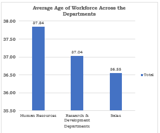
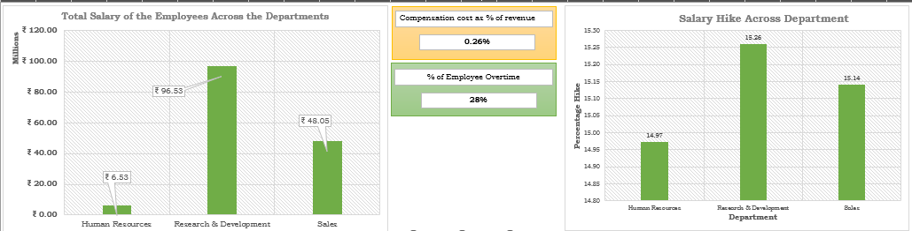

# HR Analytics Dashboards in Excel: Workforce, Retention & Compensation Insights


A comprehensive HR analytics project built in Excel to analyze workforce performance, employee retention, and compensation efficiency using interactive dashboards and business-focused KPIs.

---

## Project Overview

This project was developed to transform raw HR data into actionable business insights through interactive Excel dashboards. The solution focuses on workforce analysis, employee retention trends, and compensation efficiency to support data-driven HR decision-making.

The project simulates real-world HR reporting scenarios by creating dashboards tailored for different organizational stakeholders:
- Executive Leadership
- Employee Retention Team
- Compensation Team

---

## Project Purpose

Organizations often struggle to monitor workforce performance, understand employee attrition patterns, and evaluate compensation-related operational costs. This project was created to address these challenges by building a centralized HR analytics solution that provides meaningful insights into workforce behavior and HR performance.

### Project Objectives
- Analyze employee attrition and retention trends
- Evaluate workforce productivity and operational efficiency
- Monitor compensation and payroll-related costs
- Support strategic HR planning through KPI-driven analytics
- Present business insights using interactive Excel dashboards

---

## Key Business Questions Addressed

- Which employee groups experience the highest attrition?
- How does workforce turnover impact operational costs?
- Are compensation expenses aligned with workforce productivity?
- Which workforce demographics influence HR performance?
- How can HR metrics support executive-level decision-making?

---

## Dashboard Insights

### Executive Workforce Overview

The Executive Dashboard provides a high-level summary of workforce performance and organizational health for senior leadership.

**Key Metrics**
- Revenue per Employee
- Attrition Rate
- Average Workforce Age
- Gender Distribution
- Workforce Productivity Metrics


---

### Employee Retention Analysis

The retention dashboard focuses on employee turnover trends and identifies workforce segments with higher attrition risk.

**Key Insights**
- Attrition trends across departments and employee groups
- Employee turnover impact on operational efficiency
- Workforce retention patterns and hiring effectiveness



---

### Compensation & Cost Analysis

The compensation dashboard analyzes workforce-related operational costs and evaluates compensation efficiency across the organization.

**Key Metrics**
- Compensation Cost as % of Revenue
- Year-on-Year Compensation Growth
- Payroll Error Percentage
- Overtime Analysis
- Average Employee Travel Cost

**Key Insights**
- Compensation growth trends across the workforce
- Impact of overtime and payroll costs on operations
- Areas for improving compensation efficiency and cost control



---

## Key Insights from the Analysis

- Employee attrition was higher among specific workforce segments, indicating potential engagement and retention challenges.
- Workforce turnover creates a significant financial and operational impact due to hiring and replacement costs.
- Compensation growth trends revealed opportunities for improving cost optimization strategies.
- Overtime and employee-related operational expenses contributed noticeably to overall workforce costs.
- Workforce demographic analysis highlighted patterns related to diversity and employee distribution.

---

## Features

- Interactive Excel dashboards
- KPI-driven HR analytics
- Workforce and compensation analysis
- Data cleaning and anomaly handling
- Business-focused data visualization
- Pivot tables, charts, and slicers for interactivity

---

## Tools & Technologies

- Microsoft Excel
- Pivot Tables
- Data Visualization
- Data Cleaning & Transformation
- Dashboard Design

---

## Project Workflow

```text
                HR DATASET (CLEANED)
                         │
        ┌────────────────┼────────────────┐
        │                │                │
        ▼                ▼                ▼
 Executive Dashboard   Retention       Compensation
        │                │                │
        ▼                ▼                ▼
 Workforce KPIs     Attrition Insights   Cost Analysis
        │                │                │
        └────────────── Insights & Decisions ──────────────┘
```

---

## Project Outcome

This project demonstrates how Excel can be used as an effective analytics and reporting tool to transform HR data into actionable business insights. The dashboards improve visibility into workforce performance, employee retention challenges, and compensation efficiency while supporting strategic HR decision-making.

---

## Note

This project emphasizes analytical thinking and business insight generation rather than only dashboard development. The objective was to simulate real-world HR analytics reporting and present meaningful workforce insights through data visualization.
